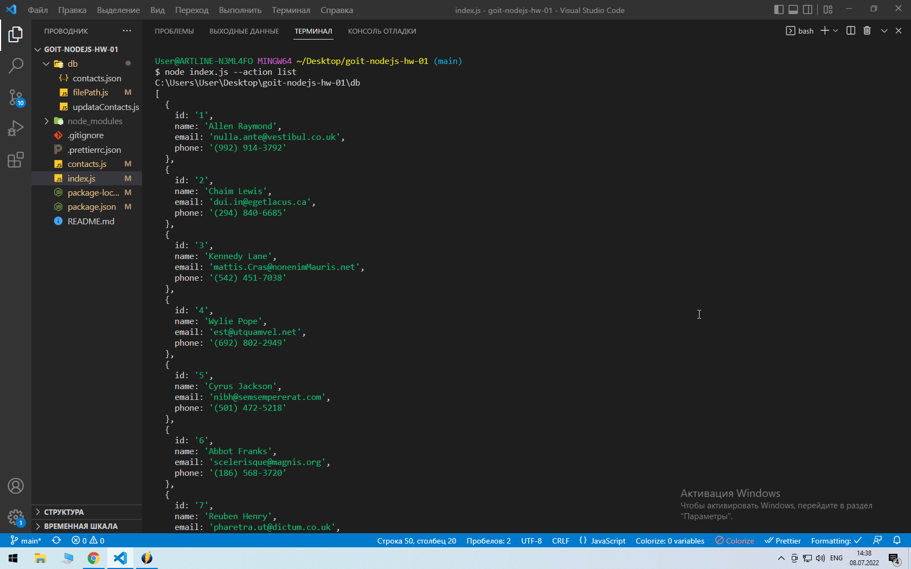
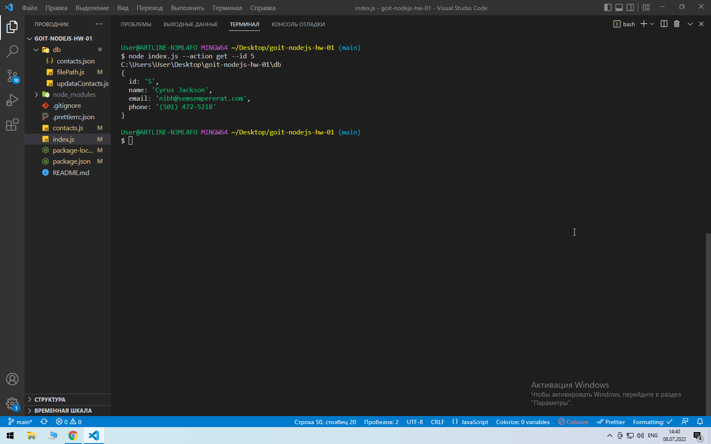
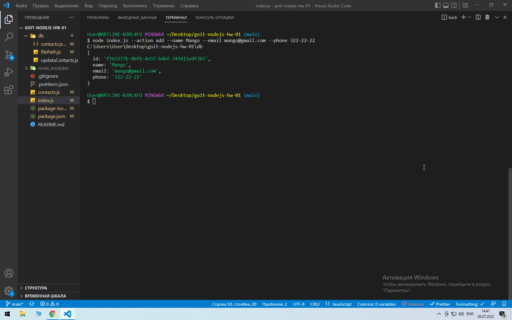
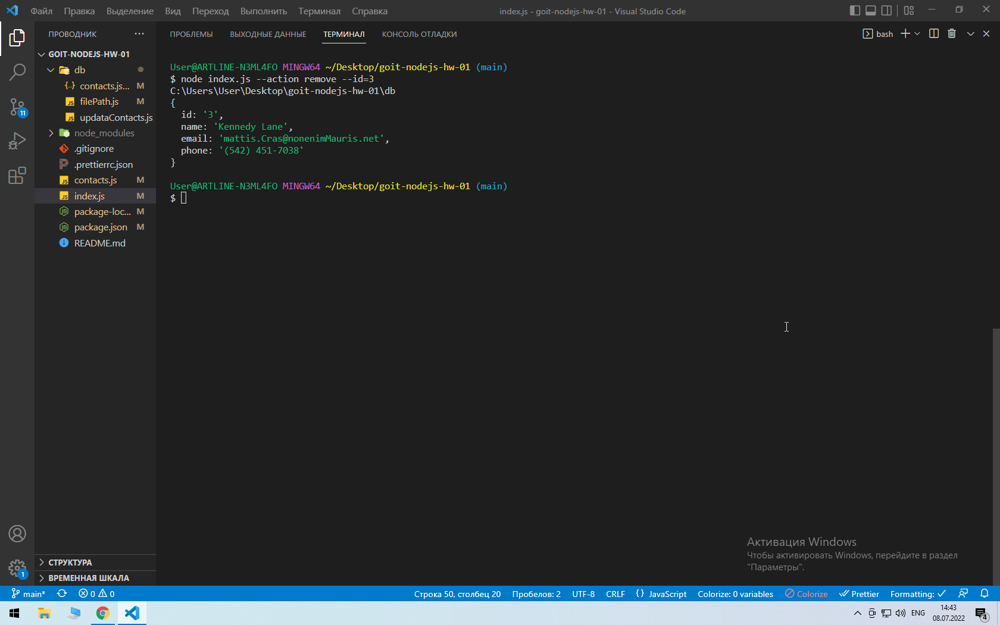

# goit-nodejs-hw-01

[list](https://monosnap.com/file/VNX01LZ6Fm3SA5TvpZVVWPendCHJKi)

[get](https://monosnap.com/file/p4QmX5JV8nh9GkRSpB1fuGguzPtt2Y)

[add](https://monosnap.com/file/rkEA5WxAj1Ih2oAB2pJhGrlhFvqj8A)

[remove](https://monosnap.com/file/YK1urCcja9HYkjSLoDkVXSCWCzXuUO)

